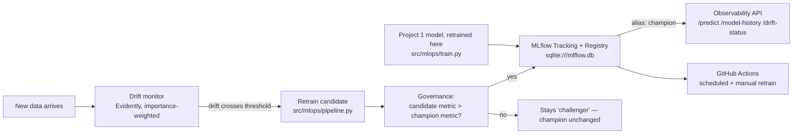

# Churn MLOps — Monitoring, Registry, and Governed Retraining

MLflow tracking + Model Registry, Evidently-based data drift monitoring, and a
governed retraining pipeline built on top of Project 1's churn model — closing the
ML lifecycle loop: what happens *after* a model is deployed and the world changes.
Part of a 5-project portfolio; see
[Project 1 (churn-pipeline)](https://github.com/HitaloUzan/churn-pipeline) for the
model this project takes over.

## 1. Business problem

A churn model that scored well at launch degrades silently as customer behavior
shifts — a promotion, a pricing change, a new competitor. Without monitoring, nobody
notices until the model's real-world accuracy has already dropped. This project
answers "what happens after deploy?" concretely: it tracks every model version, checks
incoming data for the kind of drift that actually hurts prediction quality (not just
any distributional wobble), retrains when it matters, and — critically — only
promotes a retrained candidate if it's *actually better* than what's already live, not
just because retraining happened.

## 2. Architecture



## 3. Stack and why

| Tool | Why |
|---|---|
| **MLflow (Tracking + Model Registry)** | Aliases (`champion`/`challenger`), not deprecated stages — ADR-002. sqlite backend for a full local registry with zero server setup. |
| **Evidently** | Data drift detection — but the naive "% of columns drifted" default missed the exact drift this project injected in testing; the actual trigger is importance-weighted (ADR-005), which is the most important finding in this repo. |
| **XGBoost** (same as Project 1) | Reused, not replaced — this project is about the lifecycle around the model, not a different model. |
| **FastAPI** | `/predict` (serves whichever version holds `champion`), `/model-history`, `/drift-status` — a small API on top of registry state MLflow's own UI already visualizes (ADR-008). |
| **GitHub Actions** | `retrain.yml` — scheduled + manually dispatchable, runs the drift-check → retrain → governance pipeline and commits the updated registry state back to the repo. |
| **Docker (multi-stage, trains inside the container)** | Not just packaging — a real bug (ADR-009) required this: MLflow's SQLite backend stores absolute artifact paths, so copying the host's `mlflow.db` into a Linux container would build fine and then fail at model-load time. The image trains fresh inside its own filesystem instead. |

## 4. Results

**Initial deploy** (`src/mlops/train.py`, on `reference` — 3,944 rows — evaluated on a
fixed 1,409-row `eval_holdout` never trained on): registered as `churn-classifier` v1,
promoted to `champion` (first version always is). Recall 0.8311, F1 0.6568, ROC-AUC
0.8611.

**Drift detection — the real finding of this project**: a naive "retrain if ≥30% of
columns show significant drift" threshold **failed to catch a deliberately injected
drift** in testing. The simulation shifted exactly 3 of 19 feature columns —
`Contract`, `tenure`, `MonthlyCharges`, precisely Project 1's top SHAP features — but
3/19 ≈ 15.8%, under any reasonable blanket threshold. `src/monitoring/drift.py`'s
trigger is importance-weighted instead: retrain if the blanket share crosses the
threshold **or** any critical feature drifts past its own threshold. See ADR-005 for
the full write-up — this is the one decision in the project most worth reading before
the rest.

**Retraining run** (`src/mlops/pipeline.py`, drift injected): correctly detected
(`trigger_reason: critical_feature`, drifted columns: `Contract`, `tenure`,
`MonthlyCharges`), retrained a candidate on `reference + current_drifted`, evaluated on
the same fixed `eval_holdout`:

| | Champion (v1) | Candidate (v2) |
|---|---|---|
| Recall | **0.8311** | 0.8204 |
| F1 | **0.6568** | 0.6525 |
| ROC-AUC | 0.8611 | **0.8617** |

**Governance decision: not promoted.** The candidate scored *worse* on recall — the
priority metric — so it was tagged `challenger`, not `champion`. This is the
demo working as intended, not a disappointing result: it's evidence the promotion gate
actually gates. A retraining pipeline that promotes every candidate unconditionally
isn't governance, it's a rubber stamp — see ADR-006.

**API latency**, `/predict` (registry lookup already resolved at startup, in-memory
inference only), 50 sequential requests after warmup: **p50 = 10.77ms, p95 = 11.97ms**.

## 5. How to run locally

```bash
# 1. Setup
python -m venv .venv
source .venv/Scripts/activate      # Windows Git Bash
pip install -r requirements-dev.txt

# 2. Build the MLflow registry state (mlflow.db/mlruns/ are NOT committed — see
#    ADR-007: MLflow's local file store bakes an absolute path into every artifact
#    reference at creation time, so a registry built on one machine can't be
#    cloned onto another. CI and Docker both regenerate it fresh the same way.)
python -m src.mlops.train              # registers v1, promotes to champion
python -m src.mlops.pipeline           # drift-injected retrain attempt (v2, rejected)
python -m src.mlops.pipeline --no-drift  # demonstrates the "nothing to do" path

# 3. Browse the registry (MLflow's own UI — this IS the observability dashboard, ADR-008)
mlflow ui --backend-store-uri sqlite:///mlflow.db
# → http://127.0.0.1:5000

# 4. Run the API
uvicorn api.main:app --app-dir src --reload
# → http://127.0.0.1:8000/docs

# 5. Tests + lint
pytest tests/ -v
ruff check src/ tests/
```

**Run with Docker instead** (trains fresh inside the container — see ADR-009):

```bash
docker build -t churn-mlops-api .
docker run -p 8080:8080 churn-mlops-api
curl http://localhost:8080/health
curl http://localhost:8080/model-history
curl http://localhost:8080/drift-status
```

## 6. Live deploy

Not deployed yet. `Dockerfile` and `deploy/cloudrun.yaml` are ready; local Docker is
the current verification path. Note in `deploy/cloudrun.yaml`: a real deployment would
point at a shared MLflow server (Postgres-backed), not a snapshot baked into the image
at build time — every replica needs to see the same registry state.

## 7. Limitations and next steps

- **`.github/workflows/retrain.yml` commits registry state back to the repo** — a
  pragmatic choice for a single-repo portfolio demo; a real deployment would use a
  shared MLflow tracking server so retraining doesn't require a git commit.
- **Pipeline logic is copied from Project 1, not shared** (ADR-001) — a deliberate
  trade-off for independent-repo portfolio structure, not an oversight.
- **cloudpickle over skops** (ADR-004) — a security trade-off acceptable for a
  single-operator local registry, not a multi-tenant serving platform.
- **No alerting** (roadmap mentions webhook/email on drift) — `drift-status` is
  queryable via the API and visible in the GitHub Actions run summary, but no push
  notification is wired up. A natural next step: post to Slack when
  `drift_detected: true`.
- **Next step**: deploy to Cloud Run using `deploy/cloudrun.yaml`, backed by a shared
  MLflow server instead of a build-time snapshot.
